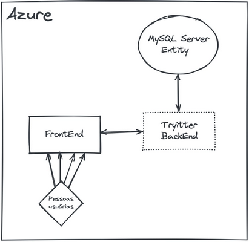

# Boas vindas ao repositório do Tryitter 🐦

## O que foi desenvolvido 👩‍💻

O `Tryitter` é uma rede social, totalmente baseada em texto. Cujo objetivo é proporcionar **um ambiente em que as pessoas estudantes poderão**, por meio de textos e imagens, **compartilhar suas experiências** e também acessar posts que possam contribuir para seu aprendizado.

## Arquitetura 🧩

A arquitetura inicial foi definida da seguinte forma:

Conforme visto na imagem acima, haverá um **Front-End** que será responsável por interagir com as pessoas estudantes e mandar as muitas requisições para o **Back-End**, que, por sua vez, será responsável por manter as informações atualizadas em um banco de dados MySQL Server usando o Framework Entity. Além disso, tudo deve ser disponibilizado na nuvem pela **Azure**.

  Nosso foco atual é desenvolver o Back-end do projeto!

## Desenvolvimento 🎯

Nessa rede social, **as pessoas estudantes devem conseguir** `se cadastrar com nome, e-mail, módulo atual que estão estudando na Trybe, status personalizado e senha para se autenticar`. Deve ser possível também `alterar essa conta a qualquer momento, desde que a pessoa usuária esteja autenticada.`

Uma pessoa estudante deve poder também `publicar posts em seu perfil, que poderão conter texto com até 300 caracteres e arquivos de imagem, além de conseguir pesquisar outras contas por nome e optar por listar todos seus posts ou apenas o último.`

Alguns pontos a que sua equipe deve se atentar são:

  Esse serviço recebe muitas requisições, então cuidado para não travar o servidor e deixar outras requisições esperando;
  Algumas rotas devem ser autenticadas por motivos de segurança;
  As principais funcionalidades do Back-End devem ter testes para garantir que sejam de boa manutenção.

## Requisitos técnicos ⚙

1. Utilizar `C#`, `SQL Server` e `Azure`;
2. Ter rotas autenticadas e rotas anônimas;
3. Utilizar os frameworks `xUnit` e `FluentAssertions` para criar testes.

## Tecnologias utilizadas 🛠

   

## Funcionalidades 📱

Implementar um C.R.U.D. para as contas de pessoas estudantes;
Implementar um C.R.U.D. para um post de uma pessoa estudante;
Alterar um post depois de publicado.

## Instalando depedências 🔽

## Executando a aplicação 🖥

## Executando os testes unitários 🧪

## Documentação da API 📒

## Considerações durante o desenvolvimento 📝

